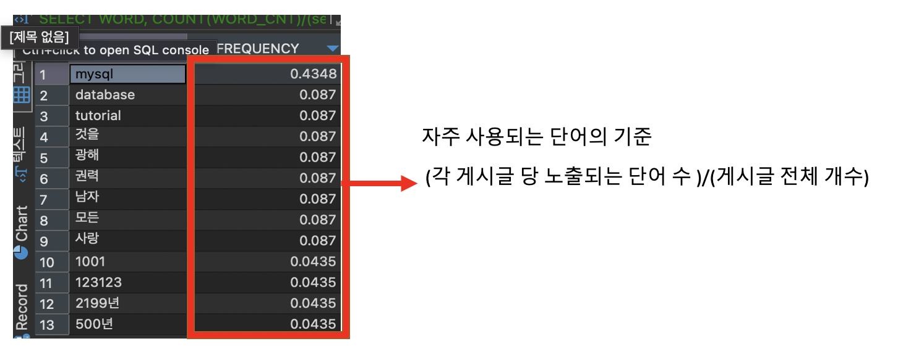
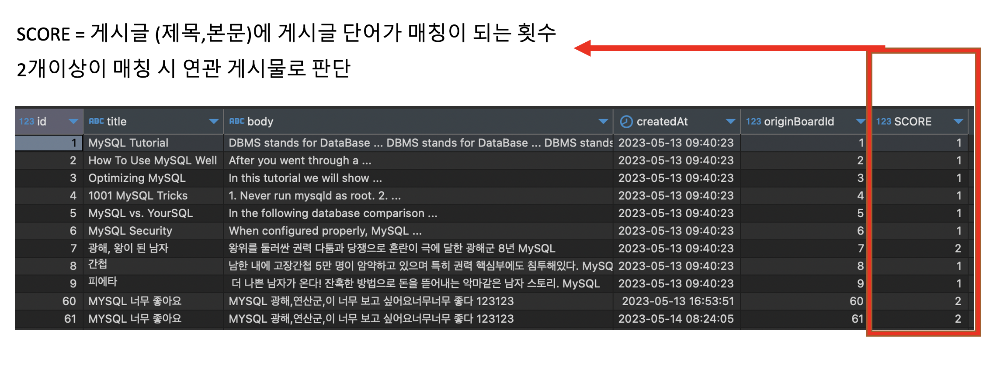

# jsshin_Board 연관 게시글

프로젝트 디렉토리구조

```bash
├── api-server       : api-server 구조
│   ├── src
│   │    ├─── common : 공통 클래스 모음
│   │    ├─── entity : db 엔터티
│   │    ├─── board  : 게시판 모듈
│   ├── test
│   │
├── simple-client    : 테스트 가능한 간단한 프론트
│   ├── src
│   │    ├─── hook   : useInput 컴포넌트
│   │    ├─── page   : 게시판 추가,리스트,연관게시글 페이지
│   │    ├─── util   : apiClient 모듈
│   │
└── db-script.sql
```

api-server 세팅 및 서버 가동

```bash
npm i --save
-- 개발모드로 실행
npm run start:dev
```

simple-client 실행 및 서버 가동

```bash
npm i --save
-- 개발모드로 실행
npm run start
```

```bash
DB_HOST=<DB접속주소>
DB_USER=<DB접속계정>
DB_PASSWORD=<DB접속패스워드>
DB_DATABASE=<DB스키마>
```

사전에 세팅될 MYSQL 환경 변수

macbook homebrew mysql 설치 기준

vim /opt/homebrew/etc/my.cnf

```LINUX
[mysqld]
# Only allow connections from localhost
bind-address = 127.0.0.1
mysqlx-bind-address = 127.0.0.1
ft_min_word_len=2               --> fulltext index 매칭 단어 길이 (단어의 길이를 최소 2로 두고 검색)
innodb_ft_min_token_size=2      --> innodb 사용시 2글자부터 검색

```

```SQL
# INNODB 엔진에 FULLTEXT 인덱스 활용하여 INNODB_FT_INDEX_TABLE 전체 게시글 연관단어 파악하기 위함
SET GLOBAL innodb_ft_aux_table = 'jsshin_Board/Board';
#  FULLTEXT 인덱스 캐시는 디스크로 플러시 적용
SET GLOBAL innodb_optimize_fulltext_only=ON;

```

동일한 테이블에 다른(INNODB,MYISAM) 엔진을 2개 생성한 이유

Innodb : FullText Index 활용하여 전체 게시글의 단여별 개수와 빈도수를 제공해주는 테이블 제공

MyISAM : FullText Index Boolean Mode 사용시 정확한 매칭 카운트를 제공 (Read 작업에 성능이 좋음)

전체 게시글의 연관 단어가 60%이상일경우 확인하는 쿼리 (INNODB_FT_INDEX_TABLE 은 INNONDB 에서만 가능 )

```SQL
    SELECT
        WORD,
        COUNT(WORD_CNT)/(select count(id) from board) as FREQUENCY
    FROM (
        SELECT
            DOC_ID,
            WORD,
            COUNT(WORD) as WORD_CNT
        FROM INFORMATION_SCHEMA.INNODB_FT_INDEX_TABLE
        GROUP BY DOC_ID,WORD
    ) table_word
    GROUP BY WORD
    HAVING FREQUENCY >= ${threshold} <<- 임계치 (여기서는 )
    ORDER BY FREQUENCY DESC
```

쿼리 결과



FullText Index를 활용하여 MYISAM엔진 게시판 테이블에 생성한 게시물 단어 매칭률을 확인하기 쿼리

```SQL
    SELECT
        b.*,
        MATCH(title,body) AGAINST('좋다 광해군 MYSQL' IN BOOLEAN  MODE) AS SCORE
    FROM Board_MYISAM_Statistics b
    WHERE MATCH(title,body) AGAINST('좋다 광해군 MYSQL' IN BOOLEAN  MODE);
```

쿼리 결과



게시글 등록시 서비스 로직 설명

```javascript
// 전체 게시글의 60% 이상의 빈도수의 단어 배열로 반환
async createBoard(board: Partial<Board>) {
    // 전체 게시글의 60% 이상의 빈도수의 단어 배열로 반환
    const excludeWords: string[] = await this.boardRepository.getExcludeWords();
    this.logger.log('excludeWords', JSON.stringify(excludeWords));
    // 트랜잭션 가동
    await this.dataSource.transaction(async (te) => {
      const saveBoard = await this.boardRepository.createBoard(board);
      // 통계용 테이블도 동일하게 적용
      await this.boardISAMStatRepository.createBoardStatistics(board);
      const fullWords = board.fullWords();
      this.logger.log('fullWords', JSON.stringify(fullWords));
      // Board_MYISAM_Statistics 테이블에서 조회한 score => 정확한 매칭룰 확인
      const relatedScore = await this.boardISAMStatRepository.getRelatedBoard(
        saveBoard.identifiers[0].id,
        fullWords,
      );
      const relatedBoards = relatedScore.map((boardScore) => {
        const createRelatedBoardDto = new CreateRelatedBoardDto(
          saveBoard.identifiers[0].id,
          boardScore.originBoardId,
          boardScore.score,
        );
        return createRelatedBoardDto.transFormRelatedBoard();
      });
      // 연관 게시물 연결
      await this.relatedBoardRepository.bulkInserts(relatedBoards);
    });
    // title, body에 검색 내용 제외
    return 'success';
  }
```

연관 게시글 조회 서비스 로직

```javascript
async getByBoardIdRelatedList(boardId: number) {
    // 게시글 상세 정보 조회
    const board = await this.boardRepository.getByIdBoard(boardId);
    // 게시글 생성시 연결된 연관 게시물 조회
    const relateBoard =
      await this.relatedBoardRepository.getByBoarddIdRelatedBoard(boardId);
    // 해당 게시글에 연관된 게시글 조회 (생성 이후에 연동되는 게시글 조회 역활)
    const relatedBoard = await this.relatedBoardRepository.getByRealtedIdBoard(
      boardId,
    );
    const result = {
      ...board,
      relate: relateBoard,
      related: relatedBoard,
    };
    return result;
  }
```
